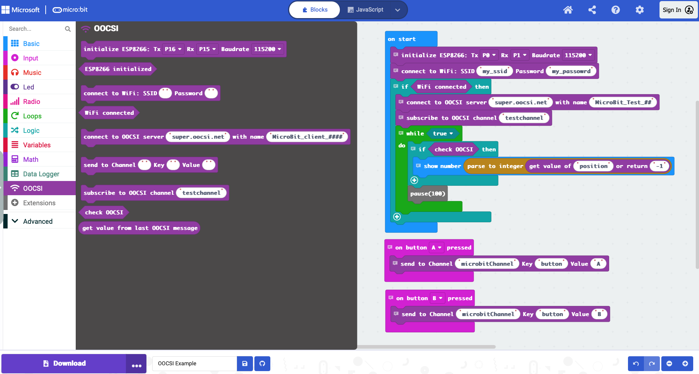

# MakeCode extension for OOCSI

This library provides an extension to connect your MicroBit v2 to the [OOCSI](https://oocsi.net) middleware using an [ESP8266 WiFi Grove Module](https://www.cytron.io/p-grv-wifi-8266) or an [ESP8266 ESP-01 module](https://www.datasheethub.com/espressif-esp8266-serial-esp-01-wifi-module/). For more information on the OOCSI design middleware, including references, open-source server, open-source libraries for other platforms and (video) tutorials, see [OOCSI](https://oocsi.net).

To connect, send data, and receive data from the OOCSI network, you need to follow these steps:
1. Initialize the WIFI module (ESP8266)
2. Connect to a WIFI network
3. Connect to an OOCSI server with the server `host` and a client `name`
4. Send data to an OOCSI channel by specifying channel `name`, `key` and `value` of the data
5. Receive data from an OOCSI channel:
    - Subscribe to an OOCSI channel with the channel `name`
    - Handle the incoming data from the channel


## ~ hint

For wiring instructions, see the guide by [LittleBirdElectronics](https://learn.littlebirdelectronics.com.au/guides/wifi-module-with-micro-bit).

## ~


You can follow the steps below or find a complete example at the bottom. The individual steps are given in TypeScript (Python will look very similar). The Blocks diagram for the full example is provided at the end.

## 1. Initialization (Selecting UART Pins and Baudrate)

The first step is initialize the ESP8266 module (Tx = P0, Rx = P1, Baudrate = 115200). This module is accessed from the MicroBit via serial communication, using two pins, and a specified Baud rate (115200 is recommended).

```blocks
oocsi.init(SerialPin.P0, SerialPin.P1, BaudRate.BaudRate115200)
```

Show happy face if successful or sad face if initialization failed. You can check if the basic connection to the ESP8266 module works with this expression. If you get the sad face, please carefully check how you have wired the ESP8266 module to your MicroBit. Sometimes switching the pins for Tx and Rx in your code fixes the problem.

```blocks
if (oocsi.isESP8266Initialized()) {
    basic.showIcon(IconNames.Happy)
} else {
    basic.showIcon(IconNames.Sad)
}
```

## 2. Connect to WiFi

After the ESP8266 is initialized and working (happy face!), you need to connect to a WiFi with an SSID (WIFI name) and a password.

```blocks
oocsi.connectWiFi("my_ssid", "my_password")
```

Again, you can easily check wether the connection is successful: show a check mark ("Yes") if connected successfully, otherwise show a cross ("No").

```blocks
if (oocsi.isWifiConnected()) {
    basic.showIcon(IconNames.Yes)
} else {
    basic.showIcon(IconNames.No)
}
```


## 3. Connect to OOCSI server

With the WIFI connected, you can finally connect to an OOCSI server. This OOCSI server could be on the Internet or running on your local network. For both cases, you will need a `host`, that is, the name for the server that is either a domain name like "super.oocsi.net" or an IP address "192.168.0.1". Carefully check for typos here. The second thing you need is a client name for your MicroBit that allows the server to identify your MicroBit. The client name is a string of characters (no whitespace), try not to use emojis or special characters; that can make things more difficult later on. We recommend using a name that ends with two or more hashes at the end ("<your name>_##"), which will be replaced by a random number on the server. This way you can ensure that you can always connect.


```blocks
// connect to the server "super.oocsi.net" with the name "MicroBit_Test_##"
oocsi.connect("super.oocsi.net", "MicroBit_Test_##")
```

When you connect to an OOCSI server, the extension will automatically start a background process to receive data.


## 4. Send data to an OOCSI channel

Sending data to an OOCSI channel is straight-forward: we just need the channel `name`, the `key` and `value` of the data. For example, we have a variable "position" that holds a value of 90 (degrees), then we can send that to the channel "positionChannel" with the key "position" like this:

```blocks
// assuming we have a variable with position value
let positionValue = 90;

// send the position value to the OOCSI channel "positionChannel" with the key "position"
oocsi.send('positionChannel', 'position', positionValue)
```

Note that `name` and `key` are strings, `value` can be anything, a boolean value, a number, a string, or even an object which will be converted into a compatible format before sending off.


## 5. Receive data from an OOCSI server

Receiving data with your MicroBit consists of two steps: first you need to subscribe to a channel, then you need to handle the incoming channel messages. Let's do this one by one.


### Subscribe to an OOCSI channel

Subscribing to a channel on the OOCSI network is as easy as specifying the channel `name`. In the following example we subscribe to the OOCSI channel "testchannel".

```blocks
// subscribe to "testchannel"
oocsi.subscribe("testchannel")
```


### Handle incoming OOCSI messages

After subscribing to a channel, you need to handle the incoming messages. First __check__ whether there is a new mesage to process, then __get__ the data in the message.

```blocks
// check if there is new data
if(oocsi.check()) {
    // this code here runs if there is indeed new data
    // ... 
}
```

We usually wrap the `oocsi.check()` in an `if` statement so the following code only runs if there is really new data. Retrieving a piece of data from the latest OOCSI message uses the function `oocsi.get()` which takes the `key` of the data and a default value in case the data is not contained in the latest message.

```blocks
// check if there is new data
if(oocsi.check()) {
    // this code here runs if there is indeed new data...

    // get data with the key "position" from the last OOCSI message, 
    // default value is "-1" in case the key is not contained
    let position = oocsi.get('position', "-1")

    // we might need to convert the string value in position to a number
    let positionValue = parseInt(position)
}
```

After the call to `oocsi.get()`, you will have a string value which you might need to convert into a boolean or number value, depending on what you have sent. 

And that's it. You are ready now for a few small examples:


## Full example

The full example is shown below as an image, then as blocks that you can import directly. The example first initializes the ESP8266, connects to a WIFI network then to an OOCSI server, and finally subscribes to the channel "testchannel". After that, the example runs through a loop to retrieve a data item "position" from incoming OOCSI messages. Further, the example registers two button handlers that each send messages to the channel "microbitChannel" when pressed.





And here is the code:

```blocks
// init the ESP8266
oocsi.init(SerialPin.P0, SerialPin.P1, BaudRate.BaudRate115200)
// connect to WIFI
oocsi.connectWiFi("my_ssid", "my_password")
// if WIFI is connected
if (oocsi.isWifiConnected()) {
    // connect to OOCSI server
    oocsi.connect("super.oocsi.net", "MicroBit_Test_##")
    // subscribe to "testchannel"
    oocsi.subscribe("testchannel")
    // in a loop, ...
    while (true) {
        // check for new messages
        if (oocsi.check()) {
            // retrieve data item "position" as number and show it
            basic.showNumber(parseInt(oocsi.get("position", "-1")))
        }

        // wait a bit
        pause(100)
    }
}

// on button A press
input.onButtonPressed(Button.A, function () {
    // send data "button: A" to "microbitChannel"
    oocsi.send("microbitChannel", "button", "A")
})
// on button B press
input.onButtonPressed(Button.B, function () {
    // send data "button: A" to "microbitChannel"
    oocsi.send("microbitChannel", "button", "B")
})

```


## License

MIT

## Supported targets

* for PXT/microbit
